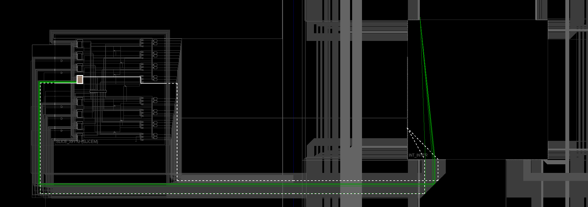
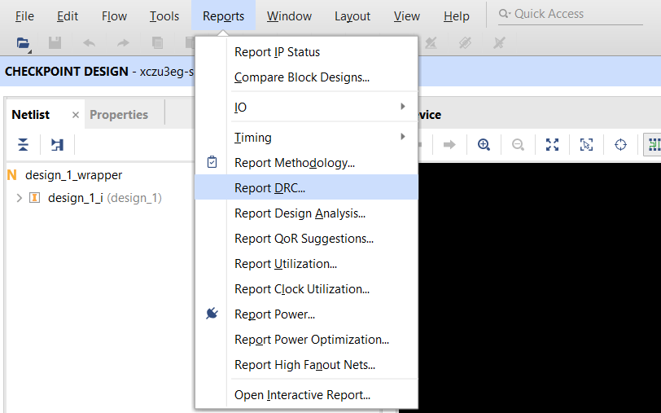
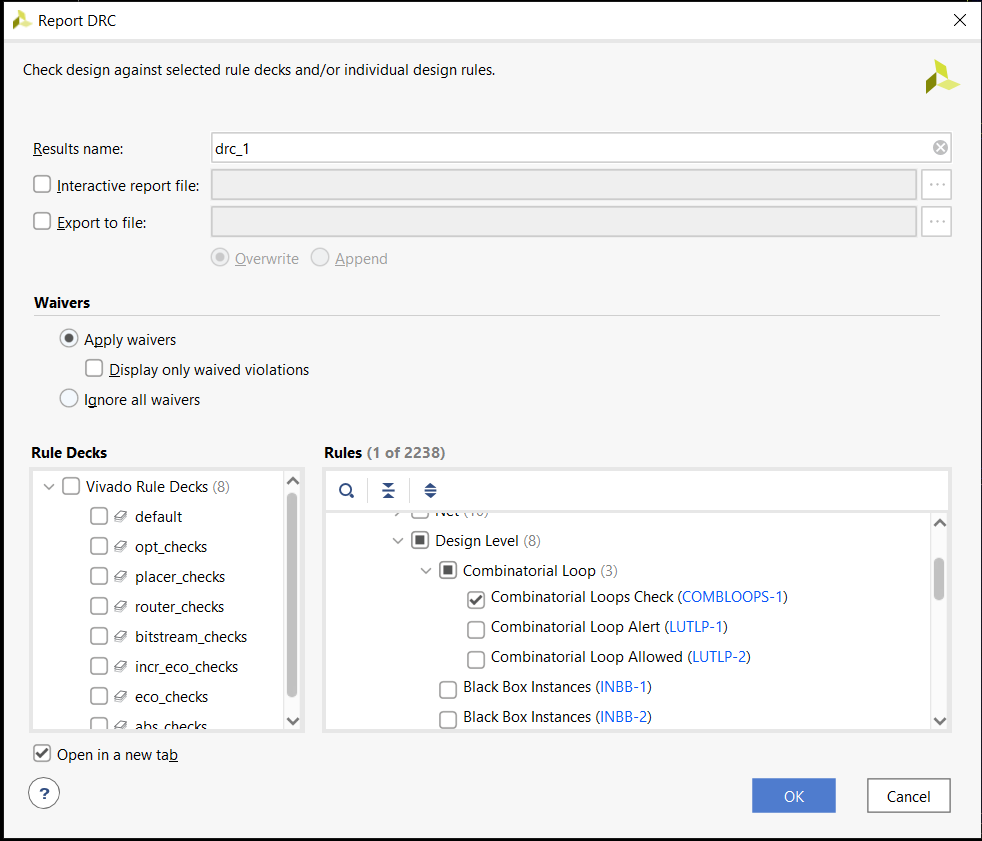
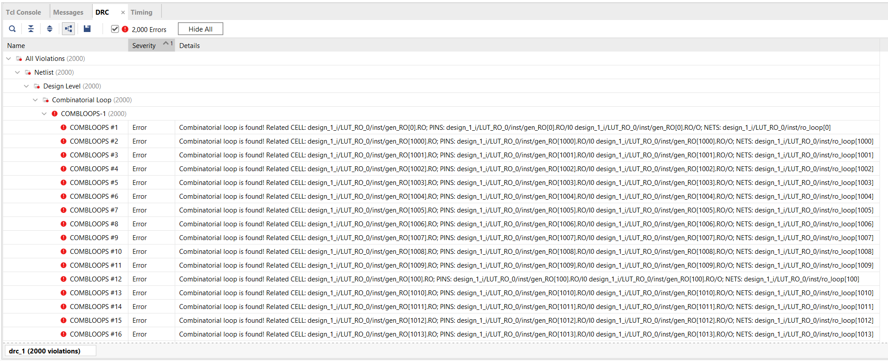
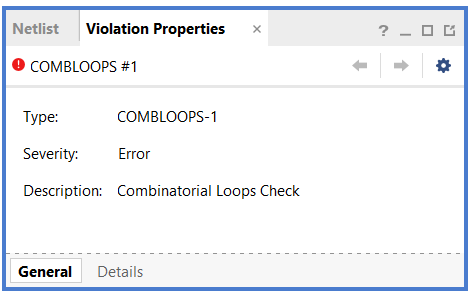
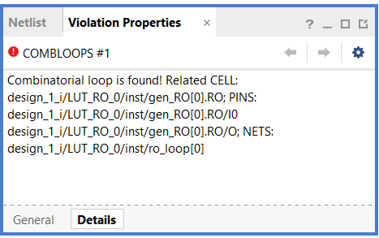

# Custom DRC for Combinatorial Loops Detection

The script adds a custom DRC to check for combinatorial loops.

This Custom DRC can detect combinatorial loops from:
- **Look Up Tables**
- **Cascading Multiplexers**
- **Carry Chain Logics**
- **Transparent Latches**
- **Digital Signal Processing Blocks**

# Compatibility

It's supposed to work with any Xilinx Vivado versions. (Tested on Vivado 2019.2 and 2020.1)
This script is compatible with Linux system and Windows Subsystem for Linux.
It's OS dependent because it is required to use 'awk' to process the data.

# Setup

To use this script, copy the content into initial script of Vivado.
- **Windows:** %APPDATA%/Xilinx/Vivado/init.tcl
- **Linux:** ~/.Xilinx/Vivado/Vivado_init.tcl

If the file does not exist, please create new and add the custom DRC in!

# Usage

- **Step 1:** Open the Design Checkpoint (*.dcp) of an Implemented Design
- **Step 2:** Select Reports > Report DRC...

- **Step 3:** Select this custom DRC is located at Rules > All Rules > Netlist > Design Level > Combinatorial Loop > Combinatorial Loops Check (COMBLOOPS-1)

- **Step 4:** Click OK then check the report!

# Bug

In case of bug, please contact me at: tuanlaminh93@gmail.com
